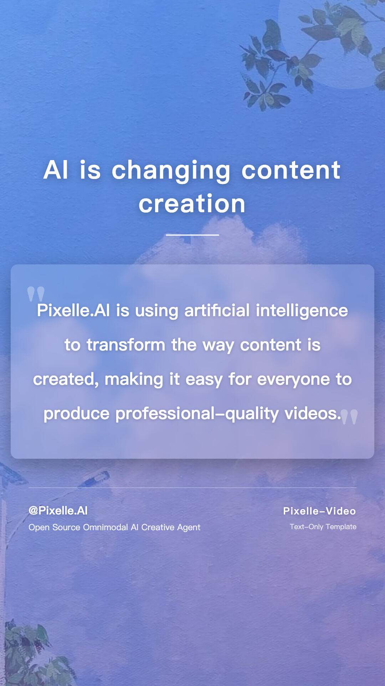
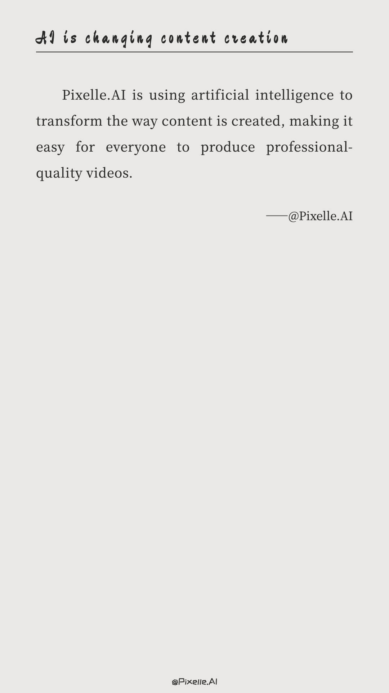

# Template Development

How to create custom video templates.

---

## Template Introduction

Video templates use HTML to define the layout and style of video frames. Pixelle-Video provides multiple preset templates covering different video dimensions and style requirements.

---

## Built-in Template Preview

### Portrait Templates (1080x1920)

Suitable for TikTok, Kuaishou, Xiaohongshu, and other short video platforms.

<div class="grid cards" markdown>

-   **static_default**

    ---

    
    
    Default static template

-   **static_excerpt**

    ---

    
    
    Text excerpt static template

-   **Blur Card**

    ---

    
    
    Blurred background card style, suitable for graphic content display

-   **Cartoon**

    ---

    
    
    Cartoon style, suitable for light and lively content

-   **Default**

    ---

    
    
    Default template, simple and versatile

-   **Elegant**

    ---

    
    
    Elegant style, suitable for artistic and intellectual content

-   **Fashion Vintage**

    ---

    
    
    Retro fashion style, suitable for nostalgic themes

-   **Life Insights**

    ---

    
    
    Life insight style, suitable for inspirational content

-   **Modern**

    ---

    
    
    Modern minimalist style, suitable for business and tech content

-   **Neon**

    ---

    
    
    Neon style, suitable for fashion and trendy content

-   **Psychology Card**

    ---

    
    
    Psychology card style, suitable for knowledge popularization

-   **Purple**

    ---

    
    
    Purple theme, suitable for dreamy and mysterious styles

-   **Satirical Cartoon**

    ---

    
    
    80s satirical cartoon style for spiritual tales

-   **Simple Black Background**

    ---

    
    
    Simple black background, suitable for inspirational content

-   **Simple Line Drawing**

    ---

    
    
    Simple line drawing style for cognitive growth content

-   **Book**

    ---

    
    
    Book style, suitable for book lists

-   **Long Text**

    ---

    
    
    Long text style, suitable for inspirational content

-   **Excerpt**

    ---

    
    
    Excerpt style, suitable for quotes and book excerpts

-   **Health Preservation**

    ---

    
    
    Health preserving tips, suitable for wellness explainers.

-   **Life Insights**

    ---

    
    
    Life insights, conveying warmth and strength

-   **Full**

    ---

    
    
    Full screen display, suitable for book lists

-   **Healing**

    ---

    
    
    Healing style, suitable for therapeutic content

-   **Video_Default**

    ---

    
    
    Default dynamic template

-   **Video_Healing**

    ---

    
    
    Healing dynamic template

</div>

---

### Landscape Templates (1920x1080)

Suitable for YouTube, Bilibili, and other video platforms.

<div class="grid cards" markdown>

-   **Ultrawide Minimal**

    ---

    
    
    Ultrawide minimalist style, suitable for desktop viewing

-   **Wide Darktech**

    ---

    
    
    Dark tech style, suitable for technology and gaming content

-   **Film**

    ---

    
    
    Film style, immersive experience

-   **Full**

    ---

    
    
    Full screen display, suitable for book lists

-   **Book**

    ---

    
    
    Book style, suitable for book lists

</div>

---

### Square Templates (1080x1080)

Suitable for Instagram, WeChat Moments, and other platforms.

<div class="grid cards" markdown>

-   **Minimal Framed**

    ---

    
    
    Minimalist framed style, suitable for social media sharing

</div>

---

## Template Naming Convention

Templates follow a unified naming convention to distinguish different types:

- **`static_*.html`**: Static templates
  - No AI-generated media content required
  - Pure text style rendering
  - Suitable for quick generation and low-cost scenarios

- **`image_*.html`**: Image templates
  - Uses AI-generated images as background
  - Invokes ComfyUI image generation workflows
  - Suitable for content requiring visual illustrations

- **`video_*.html`**: Video templates
  - Uses AI-generated videos as background
  - Invokes ComfyUI video generation workflows
  - Creates dynamic video content with enhanced expressiveness

## Template Structure

Templates are located in the `templates/` directory, grouped by size:

```
templates/
├── 1080x1920/  # Portrait
│   ├── static_*.html   # Static templates
│   ├── image_*.html    # Image templates
│   └── video_*.html    # Video templates
├── 1920x1080/  # Landscape
│   └── image_*.html    # Image templates
└── 1080x1080/  # Square
    └── image_*.html    # Image templates
```

---

## Creating Custom Templates

### Steps

1. Copy an existing template file from the `templates/` directory
2. Modify HTML and CSS styles
3. Save to the corresponding size directory with `.html` extension
4. Use the new template name in configuration or Web interface

### Template Variables

Templates support the following Jinja2 variables:

- `{{ title }}` - Video title (optional)
- `{{ text }}` - Current scene text content
- `{{ image }}` - Current scene image (if any)

### Example Template

```html
<!DOCTYPE html>
<html>
<head>
    <style>
        body {
            width: 1080px;
            height: 1920px;
            margin: 0;
            background: linear-gradient(135deg, #667eea 0%, #764ba2 100%);
            display: flex;
            align-items: center;
            justify-content: center;
            font-family: 'Arial', sans-serif;
        }
        .content {
            text-align: center;
            color: white;
            padding: 40px;
        }
        .text {
            font-size: 48px;
            line-height: 1.6;
        }
    </style>
</head>
<body>
    <div class="content">
        <div class="text">{{ text }}</div>
    </div>
</body>
</html>
```

---

## Template Development Tips

### 1. Responsive Sizing

Ensure the template's `body` size matches the target video dimensions:

- Portrait: `width: 1080px; height: 1920px;`
- Landscape: `width: 1920px; height: 1080px;`
- Square: `width: 1080px; height: 1080px;`

### 2. Text Typography

- Use appropriate font sizes and line heights for readability
- Add shadows or backgrounds to text for better contrast
- Control text length to avoid overflow

### 3. Image Handling

- Use `object-fit: cover` to ensure image filling
- Add gradients or overlay layers to improve text readability
- Consider fallback solutions for image loading failures

### 4. Performance Optimization

- Avoid overly complex CSS animations
- Optimize background image sizes
- Use system fonts or web-safe fonts

---

## More Information

For template development questions, feel free to ask in [GitHub Issues](https://github.com/AIDC-AI/Pixelle-Video/issues).

