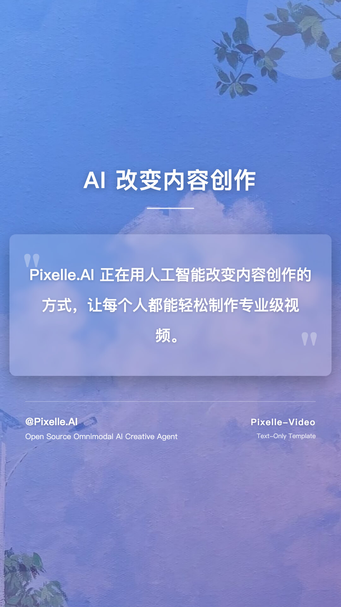
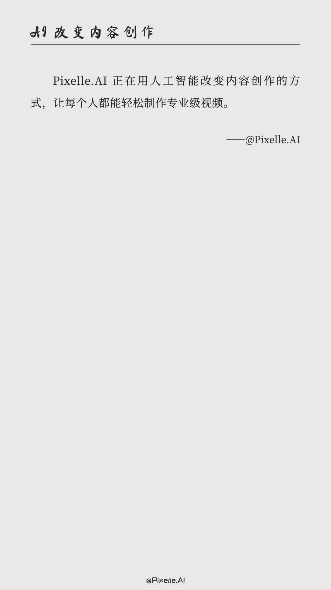

# 模板开发

如何创建自定义视频模板。

---

## 模板简介

视频模板使用 HTML 定义视频画面的布局和样式。Pixelle-Video 提供了多种预设模板，覆盖不同的视频尺寸和风格需求。

---

## 内置模板预览

### 竖屏模板 (1080x1920)

适用于抖音、快手、小红书等短视频平台。

<div class="grid cards" markdown>

-   **static_default**

    ---

    
    
    默认静态模板

-   **static_excerpt**

    ---

    
    
    图文摘抄静态模板

-   **Blur Card**

    ---

    
    
    模糊背景卡片风格，适合图文内容展示

-   **Cartoon**

    ---

    
    
    卡通风格，适合轻松活泼的内容

-   **Default**

    ---

    
    
    默认模板，简洁通用

-   **Elegant**

    ---

    
    
    优雅风格，适合文艺、知性内容

-   **Fashion Vintage**

    ---

    
    
    复古时尚风格，适合怀旧主题

-   **Life Insights**

    ---

    
    
    生活感悟风格，适合心灵鸡汤类内容

-   **Modern**

    ---

    
    
    现代简约风格，适合商务、科技内容

-   **Neon**

    ---

    
    
    霓虹灯风格，适合时尚、潮流内容

-   **Psychology Card**

    ---

    
    
    心理学卡片风格，适合知识科普

-   **Purple**

    ---

    
    
    紫色主题，适合梦幻、神秘风格

-   **Satirical Cartoon**

    ---

    
    
    80年代讽刺漫画风格，适合精神类小故事

-   **Simple Black Background**

    ---

    
    
    极简黑色背景，适合心灵鸡汤类内容

-   **Simple Line Drawing**

    ---

    
    
    简笔画，适合认知成长类内容

-   **Book**

    ---

    
    
    图书解读，适合科普类内容

-   **Long Text**

    ---

    
    
    长文本，适合励志鸡汤类内容

-   **Excerpt**

    ---

    
    
    图文摘抄，适合图文摘抄，名人名言

-   **Health Preservation**

    ---

    
    
    养生窍门，适合养生科普内容

-   **Life Insights**

    ---

    
    
    人生感悟，传递温暖与力量

-   **Full**

    ---

    
    
    全屏模版，适合书单号

-   **Healing**

    ---

    
    
    治愈模版，适合疗愈类内容

-   **Video_Default**

    ---

    
    
    默认动态模版

-   **Video_Healing**

    ---

    
    
    治愈动态模版
</div>

---

### 横屏模板 (1920x1080)

适用于 YouTube、B站等视频平台。

<div class="grid cards" markdown>

-   **Ultrawide Minimal**

    ---

    
    
    超宽屏极简风格，适合桌面端观看

-   **Wide Darktech**

    ---

    
    
    暗黑科技风格，适合技术、游戏内容

-   **Film**

    ---

    
    
    电影风格，沉浸式体验

-   **Full**

    ---

    
    
    全屏显示，适合书单号

-   **Book**

    ---

    
    
    图书解读，适合科普类内容
</div>

---

### 方形模板 (1080x1080)

适用于 Instagram、微信朋友圈等平台。

<div class="grid cards" markdown>

-   **Minimal Framed**

    ---

    
    
    极简边框风格，适合社交媒体分享

</div>

---

## 模板命名规范

模板采用统一的命名规范来区分不同类型：

- **`static_*.html`**: 静态模板
  - 无需 AI 生成任何媒体内容
  - 纯文字样式渲染
  - 适合快速生成、低成本场景

- **`image_*.html`**: 图片模板
  - 使用 AI 生成的图片作为背景
  - 调用 ComfyUI 的图像生成工作流
  - 适合需要视觉配图的内容

- **`video_*.html`**: 视频模板
  - 使用 AI 生成的视频作为背景
  - 调用 ComfyUI 的视频生成工作流
  - 创建动态视频内容，增强表现力

## 模板结构

模板位于 `templates/` 目录，按尺寸分组：

```
templates/
├── 1080x1920/  # 竖屏
│   ├── static_*.html   # 静态模板
│   ├── image_*.html    # 图片模板
│   └── video_*.html    # 视频模板
├── 1920x1080/  # 横屏
│   └── image_*.html    # 图片模板
└── 1080x1080/  # 方形
    └── image_*.html    # 图片模板
```

---

## 创建自定义模板

### 步骤

1. 从 `templates/` 目录复制一个现有模板文件
2. 修改 HTML 和 CSS 样式
3. 保存到对应尺寸目录下，使用 `.html` 扩展名
4. 在配置或 Web 界面中使用新模板名称

### 模板变量

模板支持以下 Jinja2 变量：

- `{{ title }}` - 视频标题（可选）
- `{{ text }}` - 当前分镜的文本内容
- `{{ image }}` - 当前分镜的图片（如果有）

### 示例模板

```html
<!DOCTYPE html>
<html>
<head>
    <style>
        body {
            width: 1080px;
            height: 1920px;
            margin: 0;
            background: linear-gradient(135deg, #667eea 0%, #764ba2 100%);
            display: flex;
            align-items: center;
            justify-content: center;
            font-family: 'Arial', sans-serif;
        }
        .content {
            text-align: center;
            color: white;
            padding: 40px;
        }
        .text {
            font-size: 48px;
            line-height: 1.6;
        }
    </style>
</head>
<body>
    <div class="content">
        <div class="text">{{ text }}</div>
    </div>
</body>
</html>
```

---

## 模板开发技巧

### 1. 响应式尺寸

确保模板的 `body` 尺寸与目标视频尺寸一致：

- 竖屏：`width: 1080px; height: 1920px;`
- 横屏：`width: 1920px; height: 1080px;`
- 方形：`width: 1080px; height: 1080px;`

### 2. 文本排版

- 使用合适的字体大小和行高，确保可读性
- 为文字添加阴影或背景，提高对比度
- 控制文本长度，避免溢出

### 3. 图片处理

- 使用 `object-fit: cover` 确保图片填充
- 添加渐变或遮罩层，提升文字可读性
- 考虑图片加载失败的降级方案

### 4. 性能优化

- 避免使用过于复杂的 CSS 动画
- 优化背景图片大小
- 使用系统字体或 Web 安全字体

---

## 更多信息

如有模板开发相关问题，欢迎在 [GitHub Issues](https://github.com/AIDC-AI/Pixelle-Video/issues) 中提问。

